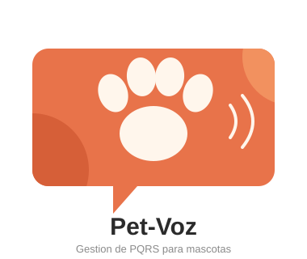

# Pet-Voz 🐾

**Sistema de Gestión de PQRS para la atención de Perros y Gatos**

> Proyecto Integrador — Algoritmia y Programación 2026-2
> Facultad de Ingeniería — Departamento de Ingeniería Industrial
> Universidad de Antioquia
 
---
 
## 1. Integrantes
 
| Nombre completo | Rol en el equipo |
|---|---|
| Andres Julian Giraldo Garcia | Líder de Proyecto |
| Anderson Leonardo Betancur Morales | Programador |
| Juan Jose Rios Ramirez | Programador |
| Dana Zapata Rodriguez | Comunicadora |
| Sofia Martinez Salgado | Diseñadora de Interfaz |
 
Somos un equipo de estudiantes del curso **Algoritmia y Programación**, encargado de diseñar y desarrollar un sistema de consola en Python para la gestión de Peticiones, Quejas, Reclamos y Sugerencias (PQRS) del Movimiento Estudiantil de Perritos y Gaticos (antes MEPEGA), ahora bajo el nombre **Pet-Voz**.
 
---
 
## 2. Vínculos académicos y descripción
 
Todos los integrantes pertenecen al programa de **Ingeniería Industrial** de la Universidad de Antioquia.
 
| Integrante | Habilidades / Fortalezas | Responsabilidad principal |
|---|---|---|
| **Andres Julian Giraldo Garcia** | Liderazgo, organización de equipos, investigación | Líder de proyecto: revisión bibliográfica y redacción del marco teórico |
| **Anderson Leonardo Betancur Morales** | Lógica de programación, diseño de arquitectura de software | Definición de la arquitectura del software, desarrollo del código base y la lógica del programa |
| **Juan Jose Rios Ramirez** | Programación, depuración y pruebas de software | Desarrollo de módulos, realización de pruebas, optimización y corrección de errores |
| **Dana Zapata Rodriguez** | Comunicación, trabajo en equipo, presentaciones | Apoyo en la elaboración de la presentación/diapositivas y comunicación del equipo |
| **Sofia Martinez Salgado** | Diseño de interfaces, redacción y estructura de documentos | Diseño de interfaz de consola, consolidación del informe, formato PDF y presentación final |
 
---
 
## 3. Nombre del proyecto y detalles
 
### Pet-Voz
 
El nombre **Pet-Voz** nace de la idea de "Pet" de mascotas y "voz" de darle la comunicacion a las peticiones, quejas, reclamos y sugerencias relacionadas con el bienestar de las mascotas (perros y gatos) atendidas en la Universidad. El sistema busca ser el canal ordenado y confiable a través del cual la comunidad estudiantil puede expresar sus solicitudes ante el equipo encargado de la atención animal. reemplazando el proceso manual (papel y lapiz) por un sistema digital organizado.

 

 ## 4. Licencia del software
  <a href="https://github.com/andresj1038/TRABAJO_FINAL/blob/main/README.md">Pet-voz</a> © 2026 by <a href="https://github.com/andersonbetancur1-collab">Andres Julian Giraldo Garcia,Anderson Leonardo Betancur Morales,Juan Jose Rios Ramirez,Dana Zapata Rodriguez,Sofia Martinez Salgado</a> is licensed under <a href="https://creativecommons.org/licenses/by/4.0/">CC BY 4.0</a>

## 5. Reporte de visión 
### Descripción general
Pet-Voz busca digitalizar y organizar el proceso de recepción y gestión de PQRS relacionadas con la atención de perros y gatos en la Universidad de Antioquia, reemplazando el registro manual en papel por un sistema de consola desarrollado en Python.
 
### Objetivo
Crear un programa de consola amigable que permita al administrador de Pet-Voz gestionar el ingreso, consulta, actualización y análisis estadístico de documentos PQRS, almacenando y exportando la información mediante archivos planos.
 
### Beneficios
- Elimina la pérdida o duplicidad de registros al reemplazar el papel por archivos digitales.
- Genera automáticamente un número de radicado consecutivo y único por tipo de solicitud.
- Permite calcular estadísticas clave (tiempos de respuesta, volumen de solicitudes, etc.) para la toma de decisiones.
- Facilita el seguimiento del estado de cada PQRS (Registrada → En proceso → Solucionada) y alerta sobre las que están próximas a vencer (30 días calendario).
- Mejora la trazabilidad y transparencia del proceso frente a la comunidad estudiantil.

## 6. Especificaciones de requisitos
### Requisitos funcionales:
- El sistema debe permitir **registrar** una nueva PQRS validando todos los datos del solicitante (nombre, tipo y número de documento, teléfono, correo, dirección) y de la solicitud (tipo, fecha, canal de recepción, asunto, descripción).
- El sistema debe asignar un **ID de registro auto-incremental e independiente** para cada uno de los cuatro tipos de documento (Petición, Queja, Reclamo, Sugerencia).
- El sistema debe **almacenar** los registros en cuatro archivos planos independientes (`Peticion.txt`, `Queja.txt`, `Reclamo.txt`, `Sugerencia.txt`).
- El sistema debe permitir **consultar** los registros activos y su estado general.
- El sistema debe permitir **actualizar el estado** de una PQRS siguiendo el flujo: Registrada → En proceso → Solucionada.
- El sistema debe **generar e imprimir un radicado** en formato TXT (ancho fijo de 120 caracteres, delimitado con marco ASCII) como comprobante de cada registro.
- El sistema debe **calcular la fecha máxima de respuesta** (fecha de registro + 30 días).
- El sistema debe **generar estadísticas**, incluyendo obligatoriamente el promedio de días de respuesta, más cinco estadísticas adicionales definidas por el equipo.

### Requisitos no funcionales 
- **Usabilidad:** el menú de consola debe ser claro, amigable e intuitivo para el administrador.
- **Rendimiento:** las operaciones de lectura/escritura sobre los archivos planos deben ejecutarse sin demoras perceptibles para el usuario.
- **Fiabilidad:** el sistema debe validar rigurosamente cada dato ingresado para evitar información inconsistente o corrupta en los archivos.
- **Mantenibilidad:** el código debe estar modularizado en archivos independientes (`validaciones.py`, `archivos.py`, `reportes.py`) para facilitar su mantenimiento.
- **Compatibilidad:** el sistema debe ejecutarse en cualquier entorno con Python instalado, sin dependencias externas complejas.

---
## 7. Plan de proyecto: 

Para el desarrollo de **Pet-Voz** se plantea un plan de trabajo que permita avanzar de manera organizada desde la planeación inicial hasta la entrega final del programa.

El proyecto se desarrollará por etapas, de forma que primero se tenga claro qué debe hacer el sistema, luego se construyan sus principales funciones y finalmente se realicen las pruebas, correcciones y documentación necesarias.

El equipo tendrá una inversión total estimada de **50 horas de trabajo**, distribuidas entre las diferentes actividades del proyecto.

### 7.2 Cronograma

El proyecto se desarrollará de forma progresiva durante las semanas restantes del semestre. Algunas actividades podrán realizarse al mismo tiempo, especialmente la documentación, las pruebas y las correcciones.

#### Diagrama de Gantt

| Actividad | S8 | S9 | S10 | S11 | S12 | S13 | S14 | S15 | S16 |
|---|:---:|:---:|:---:|:---:|:---:|:---:|:---:|:---:|:---:|
| Planeación y organización | 🟩 | | | | | | | | |
| Diseño del programa | 🟩 | 🟩 | | | | | | | |
| Registro de PQRS | | 🟩 | 🟩 | | | | | | |
| Validación de datos | | 🟩 | 🟩 | 🟩 | | | | | |
| Almacenamiento de información | | | 🟩 | 🟩 | | | | | |
| Consulta y actualización | | | | 🟩 | 🟩 | | | | |
| Generación de radicados | | | | 🟩 | 🟩 | | | | |
| Estadísticas | | | | | 🟩 | 🟩 | | | |
| Pruebas y correcciones | | | | | | 🟩 | 🟩 | 🟩 | |
| Documentación y entrega | 🟩 | | | | | 🟩 | 🟩 | 🟩 | 🟩 |

**Convención:** 🟩 Periodo estimado de trabajo.

El cronograma podrá ajustarse de acuerdo con el avance del equipo y las observaciones realizadas por el profesor durante el desarrollo del proyecto.

### 7.3 Presupuesto

Para este proyecto no se plantea un pago directo en dinero a los integrantes. El presupuesto se entiende como el **valor del tiempo de práctica y formación** que el equipo dedicará al desarrollo de Pet-Voz.

De acuerdo con las indicaciones del proyecto, el equipo invertirá en total **50 horas de trabajo**, las cuales serán valoradas tomando como referencia una práctica profesional equivalente a **1 Salario Mínimo Legal Mensual Vigente (SMLV)**.

Por esta razón, el principal recurso del proyecto será el tiempo y conocimiento aportado por los cinco integrantes.

| Recurso | Cantidad | Forma de valoración |
|---|---:|---|
| Integrantes | 5 estudiantes | Trabajo académico y de formación |
| Tiempo total del proyecto | 50 horas | Horas de práctica profesional |
| Referencia económica | 1 SMLV | Valor de referencia de una práctica profesional |
| Software utilizado | Python, Git y GitHub | Sin costo para el proyecto |
| Equipos | Computadores personales | Recursos propios de los integrantes |
| **Inversión principal** | **50 horas** | **Tiempo de formación práctica** |

Las 50 horas corresponden al tiempo total estimado para desarrollar el proyecto y se distribuyen entre las actividades presentadas anteriormente.

Aunque se utiliza **1 SMLV como referencia para valorar la práctica profesional**, este valor no representa un salario que vaya a ser pagado al equipo. Su finalidad es reconocer que el desarrollo de Pet-Voz requiere una inversión de tiempo y trabajo por parte de los estudiantes.

### 7.4 Organización y seguimiento

Para mantener organizado el proyecto, los integrantes realizarán reuniones de seguimiento en las que se revisará qué actividades se han completado, cuáles se encuentran pendientes y si es necesario realizar cambios en el cronograma.

GitHub será utilizado como espacio principal para mantener organizado el proyecto y registrar los avances realizados por el equipo.

Cada integrante participará en las actividades relacionadas con su rol, pero el desarrollo de Pet-Voz será un trabajo conjunto. Por esta razón, todos los integrantes deberán conocer de manera general el funcionamiento del programa y los cambios realizados durante el proyecto.

